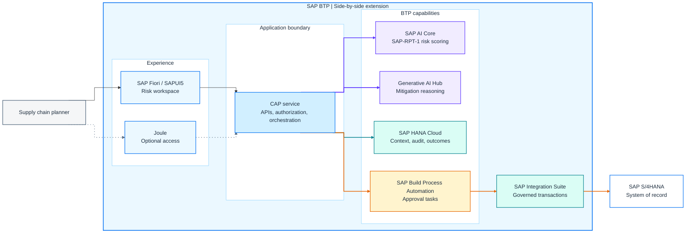

**SAP-RPT-1 in Action** — Architecting Agentic Supply Chain on SAP Business AI Platform

# Architecture Playbook: From Workshop-Grade to Production-Grade

> **Best viewed rendered.** Open **`architecture_playbook.html`** to view the diagrams and tables offline.

**Use case:** Just-In-Time (JIT) Supply Chain Risk

**Business outcome:** detect supplier delivery risk early enough to mitigate it before a line-down event.

The hands-on exercises move through **Rules → Predict → Reason** using CSV data, SAP-RPT-1, and a governed reasoning agent. This playbook focuses only on the three architecture conversations needed to take that pattern toward production:

1. the production-grade components and why they exist;
2. the data pipeline, including SAP Integration Suite and SAP HANA Cloud;
3. what production adds to each rung demonstrated in the notebooks.

---

## 1. Production Architecture: A Governed Side-by-Side Extension

The production pattern is a side-by-side extension on SAP BTP. SAP S/4HANA remains the system of record; SAP BTP adds prediction, recommendation, workflow, and decision support without embedding custom AI logic in the digital core.

### 1.1 Target Solution Architecture

**How to read it, left to right:** the planner enters through SAP Fiori/SAPUI5 or optionally Joule; both channels use the same CAP control boundary. CAP invokes prediction, reasoning, persistence, or approval capabilities. Only the approval path continues through SAP Integration Suite to SAP S/4HANA.

**Connector legend:** solid lines are governed service or transaction flows; dotted lines are optional access paths. Indigo identifies AI calls, teal identifies persistence/integration, and mango identifies the approval-to-action path. Connector labels are intentionally kept outside the diagram to preserve readability.

The diagram has one control rule: **prediction and reasoning are advisory; only an approved business action crosses back into SAP S/4HANA.**

### 1.2 Production Components and Why They Exist

| Component | Why it exists | What it owns |
|---|---|---|
| **SAP S/4HANA** | Preserves transactional integrity and clean-core boundaries | Purchase orders, supplier and material master data, receipts, executed procurement actions |
| **SAP Integration Suite** | Governs APIs, scheduled replication, mappings, credentials, monitoring, and approved transactions | Managed system-to-system integration across the SAP S/4HANA boundary |
| **SAP Event Mesh** | Decouples operational triggers from the scoring application | New or changed PO and delivery events |
| **SAP HANA Cloud** | Provides persistent production context without loading analytical work onto SAP S/4HANA | Feature-ready history, assessments, recommendations, approvals, outcomes, and audit data |
| **CAP service** | Creates the application and governance boundary around otherwise stateless AI capabilities | Domain model, APIs, authorization, orchestration, validation, persistence rules, and action eligibility |
| **SAP AI Core with SAP-RPT-1** | Produces the delay-risk signal from structured business data | Predictive inference and model execution |
| **Generative AI Hub orchestration** | Supports adaptive, multi-step mitigation reasoning when fixed rules are insufficient | Governed model access and reasoning calls; it does not own business authority |
| **SAP Fiori / SAPUI5** | Gives planners a structured risk and approval workspace | Risk triage, evidence review, mitigation review, and decision capture |
| **SAP Build Process Automation** | Adds routed approvals when the process needs roles, escalation, task handling, or process history | Approval tasks, routing, escalation, and process status |

### 1.3 Why CAP Is the Control Boundary

The model and reasoning runtime produce outputs; they do not provide an enterprise application boundary. CAP supplies the controls that make those capabilities operable:

- one domain model for risk assessments, mitigation proposals, and approval decisions;
- authorization and validation before AI or integration calls;
- normalization and persistence of predictions, recommendations, and traces;
- explicit rules for when an assessment may become an approval task;
- one governed path from an approved decision to SAP Integration Suite.

For a simple pilot, a single approval can be implemented in CAP. Use SAP Build Process Automation when approval becomes multi-step, role-routed, escalation-bound, or compliance-sensitive.

Joule is optional. It can provide another engagement surface over the same CAP services, but the control boundary does not move into the conversation layer.

---

## 2. Building the Production Data Pipeline

The notebooks score CSV data. Production must score current operational reality while preserving history, lineage, auditability, and SAP S/4HANA performance.

The pipeline has three decisions:

1. **How does data move?** Events for time-sensitive changes; batch for history and slower-moving context.
2. **How does it cross the boundary?** Direct calls may be acceptable for a pilot; SAP Integration Suite provides the governed production path.
3. **Where does production context live?** SAP HANA Cloud becomes the default once persistence, audit, monitoring, or repeatable feature assembly is required.

### 2.1 Production Data Flow

```mermaid
%%{init: {"flowchart": {"curve": "stepAfter", "nodeSpacing": 60, "rankSpacing": 50, "padding": 26}}}%%
flowchart LR
    subgraph S4["SAP S/4HANA | Operational sources"]
        direction TB
        PO["New or changed POs"]
        HISTORY["History, master data<br/>and actual outcomes"]
    end

    subgraph BTP["SAP BTP | Production data pipeline"]
        direction TB

        subgraph EVENTLANE["Event-driven scoring"]
            direction LR
            EM["SAP Event Mesh<br/>PO events"]
            CAP["CAP service<br/>Scoring request"]
            RPT["SAP AI Core<br/>SAP-RPT-1"]
        end

        subgraph CONTEXTLANE["Context and learning"]
            direction LR
            IS["SAP Integration Suite<br/>Batch and APIs"]
            FEATURES["SAP HANA Cloud<br/>Feature context"]
            RESULTS["SAP HANA Cloud<br/>Predictions and outcomes"]
            EVALUATE["Evaluation<br/>Accuracy and drift"]
        end
    end

    PO -.-> EM
    HISTORY --> IS
    EM -.-> CAP
    IS --> FEATURES
    FEATURES --> CAP
    CAP --> RPT
    RPT --> RESULTS
    IS --> RESULTS
    RESULTS -.-> EVALUATE

    classDef core fill:#FFFFFF,stroke:#0070F2,color:#1D2D3E,stroke-width:1.5px;
    classDef data fill:#DAFDF5,stroke:#07838F,color:#1D2D3E,stroke-width:1.5px;
    classDef application fill:#D1EFFF,stroke:#0070F2,color:#1D2D3E,stroke-width:1.5px;
    classDef ai fill:#F1ECFF,stroke:#5D36FF,color:#1D2D3E,stroke-width:1.5px;
    classDef monitor fill:#F5F6F7,stroke:#475E75,color:#1D2D3E,stroke-width:1.5px;

    class PO,HISTORY core;
    class EM,IS,FEATURES,RESULTS data;
    class CAP application;
    class RPT ai;
    class EVALUATE monitor;

    style S4 fill:#EBF8FF,stroke:#0070F2,stroke-width:2px,color:#1D2D3E
    style BTP fill:#EBF8FF,stroke:#0070F2,stroke-width:2px,color:#1D2D3E
    style EVENTLANE fill:#FFFFFF,stroke:#89D1FF,stroke-width:1.5px,color:#1D2D3E
    style CONTEXTLANE fill:#FFFFFF,stroke:#89D1FF,stroke-width:1.5px,color:#1D2D3E

    linkStyle 0,2 stroke:#07838F,stroke-width:2px,stroke-dasharray:8 5;
    linkStyle 1,3,4,7 stroke:#07838F,stroke-width:2px;
    linkStyle 5,6 stroke:#5D36FF,stroke-width:2px;
    linkStyle 8 stroke:#556B82,stroke-width:1.5px,stroke-dasharray:8 5;
```

**How to read it, left to right:** the upper lane handles time-sensitive PO events and scoring. The lower lane supplies historical context and actual outcomes. SAP HANA Cloud feature context feeds the CAP scoring request; the resulting prediction is paired with actual outcomes for evaluation.

**Connector legend:** dashed teal lines are asynchronous events; solid teal lines are batch, API, or persistence flows; indigo is predictive inference; dashed grey is the evaluation feedback path. Connector meaning is explained here rather than placed over the diagram.

### 2.2 Events and Batch Have Different Jobs

| Data | Recommended movement | Why |
|---|---|---|
| New or changed purchase orders and delivery confirmations | **Event-driven** through SAP Event Mesh | The decision loses value if scoring arrives after the mitigation window |
| Supplier, material, and historical delivery context | **Scheduled batch or governed APIs** through SAP Integration Suite | The data changes more slowly and is more efficient to curate in bulk |
| Goods receipts and actual delivery outcomes | **Scheduled reconciliation** through SAP Integration Suite | Evaluation needs paired predicted-versus-actual records, not another real-time decision path |

The architecture should earn event-driven complexity from the decision's latency requirement. Do not introduce eventing merely because it is technically available.

### 2.3 Why SAP Integration Suite Is in the Production Path

Direct OData calls can be acceptable for a narrow pilot. SAP Integration Suite becomes valuable when production requires:

- traffic controls that protect SAP S/4HANA;
- centralized credentials and certificate handling;
- mapping between SAP S/4HANA APIs and the sidecar domain model;
- retries, monitoring, and operational ownership of failed integrations;
- one governed route for approved business transactions.

This does not mean every internal call must traverse SAP Integration Suite. CAP can invoke bound SAP BTP services directly. Integration Suite is primarily the governed boundary for SAP S/4HANA and other enterprise systems.

### 2.4 When SAP HANA Cloud Is Optional — and When It Is Not

| Solution shape | SAP HANA Cloud position | Reason |
|---|---|---|
| Workshop or short-lived demo using CSV data | **Optional** | Persistence and production audit are outside the exercise |
| Narrow single-PO pilot using read-through APIs and minimal history | **Optional, with an explicit limitation** | CAP can assemble and score one request, but the design has weak history and monitoring |
| Production solution with repeatable feature assembly, audit, analytics, feedback, or event-driven scale | **Recommended default** | Production context must be persistent, queryable, and decoupled from transactional SAP S/4HANA APIs |

SAP HANA Cloud is not required simply because the solution runs on SAP BTP. It becomes the default because this use case needs historical context, prediction and decision records, actual outcomes, and a durable audit trail.

### 2.5 Close the Prediction Feedback Loop

Exercise 1B asks whether the prediction is good enough for the decision. Production must keep answering that question after go-live.

A scheduled reconciliation process pairs each stored prediction with the eventual goods-receipt outcome from SAP S/4HANA. That dataset supports:

- decision-aligned accuracy measurement;
- drift detection as supplier behavior and lead times change;
- error analysis by supplier, material, or risk tier;
- evidence for recalibration or retraining.

Without this loop, the application can keep generating predictions but cannot demonstrate that they remain useful.

---

## 3. Rules → Predict → Reason: What Production Adds

The Decision Ladder is the connective tissue across the notebooks. It is not a maturity model and there is no reward for reaching the top. Use the lowest rung that meets the decision.

### 3.1 Align the Architecture Discussion to the Hands-On

| Rung | What the notebooks demonstrate | When it fits | What production adds |
|---|---|---|---|
| **Rules** | Green / Amber / Red policy and deterministic mitigation logic | The decision path is stable and can be written down | Versioned policy, authorization, testing, and an audit trail |
| **Predict** | SAP-RPT-1 turns structured ERP-style data into a delay-risk signal; Exercise 1B evaluates whether the signal is decision-useful | Historical structured data contains a pattern that rules cannot express | Repeatable features, decision-aligned metrics, model/version lineage, monitoring, and drift detection |
| **Reason** | A ReAct agent selects bounded tools, produces a trace, and proposes a mitigation for human review | The next step depends on findings and the decision requires multi-criteria trade-offs | Tool authorization, step and cost limits, retries, trace persistence, evidence requirements, and human approval |

**Decision test:** if a fixed rule or predictive signal already determines the next action, an agent adds cost and governance without adding decision value.

### 3.2 Keep Business Authority Outside the Model

The notebooks deliberately separate three responsibilities:

1. **Prediction** produces a risk signal.
2. **Reasoning** proposes a mitigation and explains the evidence.
3. **A person with the appropriate role** approves or rejects the sourcing-impacting action.

The first two are advisory. Approval creates business authority. Only after approval should a governed integration execute a procurement action in SAP S/4HANA.

### 3.3 Minimum Production Guardrails

Before scaling this pattern, require:

- **Data quality and freshness:** the scoring context is current, complete, and traceable to its source.
- **Model quality:** the team owns the evaluation metric, operating threshold, error trade-off, and drift response.
- **Agent control:** tools are allow-listed and authorized; steps, tokens, latency, retries, and cost are bounded.
- **Evidence and audit:** predictions, model versions, tool calls, recommendations, approvals, overrides, and outcomes are reconstructable.
- **Human decision rights:** approval roles, thresholds, escalation, and segregation of duties are explicit.
- **Operational ownership:** failures in events, APIs, scoring, reasoning, approval, and write-back have monitoring and accountable owners.

---

## Final Takeaway

The transition from the notebooks to production is not “put the model behind an API.” It requires three deliberate moves:

1. establish a governed side-by-side application boundary around the AI capabilities;
2. build a durable data pipeline that supplies current context and captures actual outcomes;
3. add only the controls demanded by the chosen rung of the Decision Ladder.

**SAP S/4HANA remains authoritative. SAP BTP supplies intelligence and control. The model recommends; the enterprise decides.**
