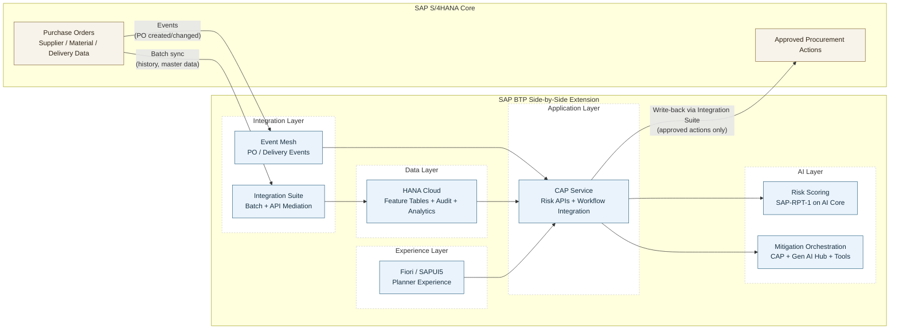
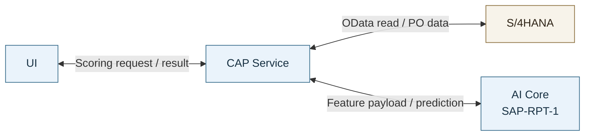
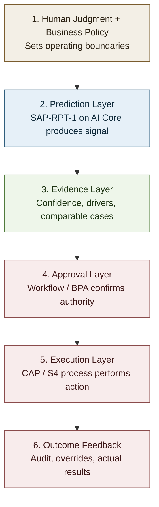
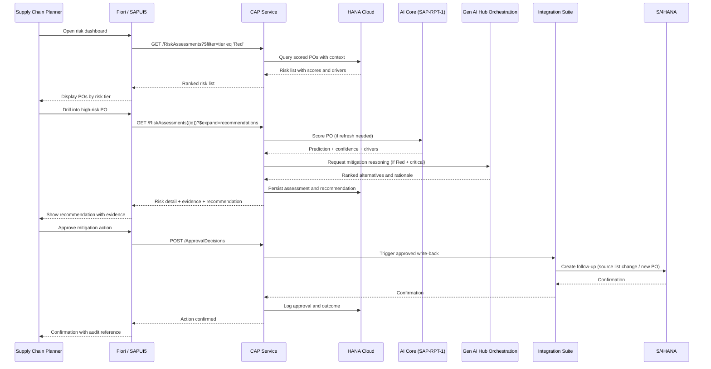
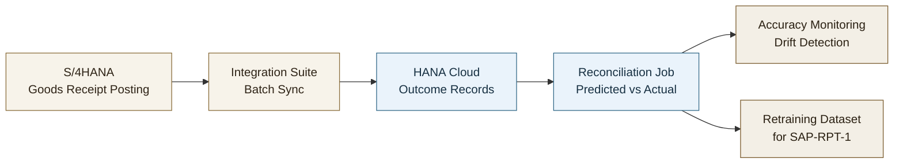

**SAP-RPT-1 in Action** — Architecting Agentic Supply Chain on SAP Business AI Platform

# Architecture Playbook: From Workshop-Grade to Production-Grade

> **📖 Best viewed rendered.** For diagrams and tables to display, open **`architecture_playbook.html`** in any browser (renders offline — no setup) — or install the recommended *Markdown Preview Mermaid Support* extension when your editor prompts, then use the Markdown preview.

**Use case:** Just-In-Time (JIT) Supply Chain Risk

**The problem:** unplanned production downtime caused by supplier delivery failures nobody saw coming in time to mitigate. Detect delay risk early enough to act — source alternatively, expedite, or reschedule — before a line-down event. Everything here serves that one outcome.

---

### The Decision Ladder — the spine of this playbook

The workshop built one pattern: **climb only as high as the decision requires — and the higher you climb, the more you govern.** Every section below maps back to a rung.

| Rung | The decision it fits | BTP building block | What you must govern |
|------|----------------------|--------------------|----------------------|
| 🔵 **Rules** | Threshold- and policy-driven | CAP business rules / BPA | Audit trail |
| 🟢 **Predict** | Structured input → risk score | `sap-rpt-1` on AI Core | Accuracy + drift |
| 🟠 **Reason** | Multi-step, multi-variable mitigation | Agent on Gen AI Hub + governed tools | Reasoning trace + human approval |

> **The rule that never changes:** AI is advisory on every rung. **The agent recommends. The enterprise decides.**

**How to read this playbook** — four recurring markers:
📘 **Knowledge Point** (the idea) · 🧭 **Decision** (the call you must make in your landscape) · ✅ **Takeaway** (what good looks like) · 🏭 **What breaks in production** (how the workshop-grade version fails at scale).

---

### From the Lab to Production

You built the ladder in the exercises: Green/Amber/Red tiers (1A), an SAP-RPT-1 prediction rung with confidence (1B), and a reasoning agent that *recommends* but does not decide (2). **This playbook hardens that same ladder** for scale, audit, clean-core boundaries, and governed decision rights on BTP.

📘 **Knowledge Point:** The real architectural question is not how to package notebook logic. It is **where to draw the boundary between the digital core (S/4HANA) and the intelligence sidecar (BTP).** This use case is a clean-core, side-by-side extension:

| Layer | Role |
|-------|------|
| **S/4HANA** | System of record — stays authoritative |
| **SAP BTP** | Prediction, recommendation, workflow, decision support |
| **HANA Cloud** | Operational data foundation for production |
| **AI** | Advisory until a governed business action is approved |

## 1. Recommended Production Pattern

> **Serves all three rungs** — this is the container the Ladder runs inside.

📘 **Knowledge Point:** The enterprise pattern is a **side-by-side BTP extension**, not AI embedded in S/4 custom code.

| Principle | Stays in S/4HANA | Lives on BTP |
|-----------|------------------|--------------|
| Transactional integrity & business ownership | ✅ | |
| Prediction, recommendation, orchestration | | ✅ (the sidecar) |
| Data | System of record | Replicate *only* what scoring needs |
| Write-back | Receives *approved outcomes only* | CAP controls what crosses back |

**CAP is the application boundary, not the system of record. HANA Cloud is the operational data foundation** when persistence, analytics, auditability, and repeatable feature computation are needed.

### 1.2 Target Solution Architecture

**Reading the diagram:** S/4HANA data flows into BTP via two paths — batch synchronization through Integration Suite for historical context and master data, and event-driven updates through Event Mesh for real-time PO triggers. CAP owns the sidecar orchestration and governance boundary, while Integration Suite mediates production write-back to S/4. Only approved business outcomes cross back into S/4.

### 1.3 What Lives Where

| Concern | System of Record |
|---------|------------------|
| Purchase orders, supplier master, material master, confirmations | SAP S/4HANA |
| Replicated historical context for scoring | HANA Cloud sidecar |
| Risk predictions and confidence | BTP sidecar |
| Agent recommendations and reasoning trace | BTP sidecar |
| Approval workflow state | BTP workflow/CAP, optionally mirrored to S/4 via business status |
| Final approved sourcing or procurement action | SAP S/4HANA |

### 1.4 What CAP Does in This Architecture

📘 **Knowledge Point:** CAP is **the system of control** — the one place where authorization, persistence, approval eligibility, audit, and write-back are enforced. It is *not* a pass-through proxy.

| CAP's job | What it means here |
|-----------|--------------------|
| **Owns the sidecar domain model** | `RiskAssessments`, `MitigationProposals`, `ApprovalDecisions` in CDS, persisted to HANA Cloud |
| **Exposes APIs for the UI** | Fiori/SAPUI5 consumes OData or REST served by CAP |
| **Orchestrates AI calls** | Handlers invoke AI Core (predict) and Gen AI Hub (reason), then normalize, authorize, persist |
| **Enforces governance** | AuthZ checks, input validation, write-back eligibility live in the service layer |
| **Mediates write-back to S/4** | Only an approval event triggers the Integration Suite flow into ERP |

**Why this matters for a custom AI solution:** the prediction and the agent are stateless capabilities. Everything that makes the solution *governable* — who may see what, what gets persisted, what is allowed to reach S/4 — lives in CAP. Remove CAP and you have a model with no boundary. (CAP ≠ Joule; see §3.6 for why the control boundary is not the conversation layer.)

### 1.5 Write-Back: Recommended Position

🧭 **Decision:** *What crosses back into S/4HANA?* The clean-core default — **keep predictions, confidence, explanations, and agent proposals in the BTP sidecar; write back to S/4 only when a business action is approved.** Raw AI artifacts are advisory, change frequently, and need richer audit storage than ERP tables should carry. Pick a write-back pattern by intent:

| Pattern | When to use it | Recommended? |
|---------|----------------|--------------|
| No write-back; planner works in sidecar UI | Advisory use case, early rollout, low process coupling | Yes, for pilots |
| Write back a status/note/reference ID to S/4 | Business wants ERP visibility of an external assessment | Often useful |
| Write back approved change request or follow-up task | Human approved a sourcing mitigation that must be executed in ERP | Yes |
| Write back raw score, confidence, and full reasoning trace into S/4 tables | Only if there is a strict ERP reporting requirement | Usually no |

### 1.6 When HANA Cloud Is Optional vs Required

HANA Cloud should not be described as generically optional. It is optional only for a narrow architecture shape.

| Situation | HANA Cloud Optional? | Reason |
|-----------|----------------------|--------|
| Single-PO scoring with direct read-through to S/4 and minimal persistence | Yes | CAP can call S/4 APIs and AI Core directly |
| Short-lived demo or workshop with CSV/object storage | Yes | Lightweight prototype mode |
| Need historical context assembly across vendors, materials, and delivery outcomes | No, effectively required | Feature computation and repeatable scoring need a persisted sidecar |
| Need prediction audit trail, recommendation history, analytics, or monitoring | No, effectively required | Operational governance requires structured persistence |
| Need event-driven scaling and decoupled reporting from S/4 | No, effectively required | Sidecar data store avoids overloading transactional APIs |

**Lightweight path (no HANA Cloud):**

In this path, CAP calls S/4 directly per scoring request, assembles the feature payload, invokes SAP-RPT-1, and returns the result. No persistent sidecar means no audit trail, no historical feature store, no feedback loop. Fine for a demo or narrow pilot; it does not scale.

✅ **Takeaway:** Once this JIT use case moves beyond a demo, **HANA Cloud is the recommended default, not an optional add-on.** The full data-pipeline rationale — mesh vs. batch, Integration Suite, and where HANA Cloud earns its place — is in [§4](#4-integration-and-data-architecture-building-the-data-pipeline).

---

## 2. Architecture Decision Guide — Rules → Predict → Reason

📘 **Knowledge Point:** The three rungs are choices about *how much AI sophistication a decision actually requires* — not a maturity ladder to climb to the top. **Start on the lowest rung that meets the need; climb only when the decision genuinely demands it.** Every step up buys flexibility and costs oversight.

> **Governance rule:** *the higher you climb, the more you govern.* Rules need policy sign-off; Predict adds accuracy monitoring and drift detection; Reason adds tool guardrails, reasoning traces, and human approval before any sourcing-impacting action.

🧭 **Decision:** *Which rung does this decision need?* Match the question to the rung — then follow the climbing order (Rules → Predict → Reason), keeping human approval on any sourcing-impacting action regardless of rung.

| Decision Question | Recommended Rung | Why |
|------------------|------------------|-----|
| Is the problem primarily threshold- and policy-driven? | **Rules** — Deterministic rules/workflow | Lowest complexity and highest control |
| Is the input mainly structured ERP/tabular data and output is a risk score? | **Predict** — `sap-rpt-1` prediction on AI Core | Best fit for tabular predictive inference |
| Is adaptive multi-step reasoning needed across tools? | **Reason** — Agentic orchestration with guardrails | Adds value only when workflow is ambiguous |
| Is capability already available in SAP embedded AI/Joule for the same process? | Adopt embedded capability first | Faster time-to-value and lower operational burden |

🧭 **Decision:** *If prediction already works, what problem is the agent actually solving?* Add an agent **only** where mitigation requires multi-step reasoning across tools, constraints, and trade-offs.

> *Example:* The prediction flags a high-risk PO for a critical material. A rule can fire a notification — but choosing the *right* mitigation means weighing alternative suppliers against inventory positions, contractual lead times, quality certifications, landed-cost thresholds, and production-schedule constraints simultaneously. That multi-variable trade-off is where an agent earns its keep over static rules.

### Trust Chain for Adoption

The model contributes predictive signal, but trust comes from evidence, approval, and auditability.

---

## 3. Application Architecture on SAP BTP

### 3.1 Target User Experience

📘 **Knowledge Point:** In production the solution is a planner-facing application — the operational surface where prediction, explanation, recommendation, and approval meet. It does three things well:

- surfaces current PO risk in business-friendly terms
- shows enough evidence for a human to trust *or challenge* the recommendation
- routes mitigation through explicit approval, not hidden automation

### 3.2 Planner Journey

End-to-end planner experience in the target application:

### 3.3 Recommended BTP Components

| Capability | Recommended BTP Building Block |
|------------|--------------------------------|
| Business UI | SAP Fiori elements or SAPUI5 |
| Application/API layer | CAP |
| Predictive inference | SAP AI Core with `sap-rpt-1` |
| Agentic recommendation | CAP/application orchestration using Gen AI Hub orchestration and governed tools |
| Identity and authorization | XSUAA |
| Workflow and approval | SAP Build Process Automation or workflow service |

### 3.4 Workflow: BPA vs. CAP-Native Logic

| Consideration | SAP Build Process Automation | CAP-native workflow logic |
|---------------|------------------------------|--------------------------|
| Multi-step approval with escalation | Preferred — visual workflow designer, task inbox, SLA tracking | Possible but requires custom implementation |
| Audit trail and compliance | Built-in process logs and decision history | Must be implemented manually |
| Early pilot with single approver | Heavier than needed | Simpler and faster to build |
| Integration with SAP Task Center | Native | Requires additional configuration |

🧭 **Decision:** *BPA or CAP-native for the approval flow?* Use **SAP Build Process Automation** for anything multi-step, role-routed, or compliance-bound. Use lightweight CAP-native logic only for simple single-approver flows in early pilots where build speed wins.

### 3.5 Application Design Principles

- Keep the CAP service as the orchestration and governance boundary
- Separate prediction from recommendation so each can be governed independently
- Present evidence with every high-risk recommendation
- Require human approval for any sourcing-impacting step
- Design for advisory-first rollout, even if later phases add deeper automation

### 3.6 CAP ≠ Joule — System of Control vs. System of Engagement

📘 **Knowledge Point:** The most common confusion in these solutions is treating CAP and Joule as alternatives. They answer different questions:

| | **CAP** | **Joule** |
|---|---------|-----------|
| **Answers** | *What is allowed?* | *How does the user ask?* |
| **Role** | System of **control** | System of **engagement** |
| **Owns** | Domain model, authZ, persistence, approval eligibility, audit, write-back | Conversational front door, natural-language intent |
| **Can it be removed?** | No — remove it and there is no governance boundary | Yes — it's one of several possible UX surfaces |

**So the UX choice is between two *engagement* surfaces over the *same* CAP control boundary — not an architecture choice:**

| | **CAP + Fiori / SAPUI5** | **CAP + Joule** |
|---|--------------------------|-----------------|
| **Best for** | Queue-based triage, dense risk tables, bulk review | Conversational inquiry, guided single-case assistance |
| **Interaction** | Visual, structured, list-and-drill | Natural language, ask-and-answer |
| **Governance** | Enforced in CAP — identical either way | Enforced in CAP — identical either way |
| **Verdict** | Default for the planner triage workflow | Add as a front door; often both, same services |

🧭 **Decision:** Don't ask *"CAP or Joule?"* Ask *"what is the system of engagement, and what is the system of control?"* Joule (and Fiori) are engagement; **CAP is the control boundary.** Where SAP ships an embedded Joule capability for this exact process, adopt it first — build custom CAP/Joule extensions only for genuine gaps, differentiating logic, or sidecar-specific data.

✅ **Takeaway:** Both channels call the same governed CAP services. The control boundary never moves to the conversation layer.

---

## 4. Integration and Data Architecture — Building the Data Pipeline

📘 **Knowledge Point:** The single biggest leap from POC to production is **the data pipeline.** A notebook scores a CSV. Production scores *live operational reality* — continuously, auditably, and without overloading S/4. Get this layer right and every rung of the Ladder becomes operable; get it wrong and the model is accurate on stale data nobody trusts.

The pipeline has three questions: **how data moves** (mesh vs. batch), **how it crosses the boundary** (Integration Suite vs. direct), and **where it lands** (HANA Cloud vs. not).

### 4.1 How Data Moves — Mesh vs. Batch

🧭 **Decision:** *Real-time or scheduled?* Neither alone — production is a **hybrid**. Match the transport to the data's cadence and the decision's latency need:

| | **Event-driven (Event Mesh)** | **Batch (scheduled sync)** |
|---|-------------------------------|----------------------------|
| **Carries** | New/changed POs, confirmations, operational triggers | Historical context, supplier performance, master/reference data |
| **Latency** | Near real-time (seconds–minutes) | Hours–daily |
| **Why** | Timely scoring on newly created POs | Slower-changing data doesn't need per-event cost |
| **Risk if misused** | Over-engineering low-cadence data | Stale scores, missed line-down windows |

**Event Mesh vs. Advanced Event Mesh:** use **SAP Event Mesh** for simpler in-BTP eventing. Move to **Advanced Event Mesh** when you need enterprise-grade distribution, higher resilience, multi-environment routing, or broad event operations across landscapes.

✅ **Takeaway:** Events for POs, batch for master data. The hybrid avoids hammering S/4 with read-through queries while keeping newly created POs scored in time to act.

### 4.2 Event-Driven Scoring Architecture

```mermaid
flowchart LR
   S4["S/4HANA<br/>PO Created"] --> EM["SAP Event Mesh<br/>Topic"]
   EM --> CAP["CAP Service<br/>Event Handler"]
   CAP --> RS["Risk Scoring<br/>SAP-RPT-1"]
   RS --> HC["HANA Cloud<br/>Persist Score + Audit"]
   HC --> AG["If Red + Critical<br/>Agent Flow"]
   AG --> NT["Notification<br/>to SC Manager"]

   classDef source fill:#f7f3ea,stroke:#8a6d3b,color:#2f2417,stroke-width:1px;
   classDef app fill:#eaf3fb,stroke:#356a8a,color:#173042,stroke-width:1px;
   classDef action fill:#edf6ed,stroke:#4d7a4d,color:#183218,stroke-width:1px;

   class S4,EM source;
   class CAP,RS,HC app;
   class AG,NT action;
```

Every prediction is persisted to HANA Cloud *before* downstream processing — auditability holds whether or not the agent flow triggers.

### 4.3 How Data Crosses the Boundary — Integration Suite vs. Direct

🧭 **Decision:** *Direct OData or Integration Suite?* Direct calls work for a pilot; production routes through **Integration Suite**.

| Decision | Pilot-grade | Production-grade | Recommendation |
|----------|-------------|------------------|----------------|
| **Data sync** | Batch (daily) | Event-driven | Event for POs; Batch for master data |
| **S/4 access** | Direct OData | Integration Suite | Integration Suite for production |
| **Context storage** | In-memory | HANA Cloud | HANA Cloud for persistence + analytics |
| **Scoring trigger** | Scheduled batch | On PO creation | Event-driven for critical; Batch for bulk |

**Why Integration Suite over direct OData for production** — it adds four things a raw call cannot: API throttling and rate limiting to protect S/4 transactional performance; centralized credential and certificate management; transformation/mapping when the S/4 API shape doesn't match the sidecar model; and monitoring/alerting on integration failures. For a side-by-side extension these outweigh the simplicity of direct calls.

### 4.4 Where Data Lands — The HANA Cloud Decision

📘 **Knowledge Point:** Under-investing in sidecar persistence is the **most common architectural gap** in these solutions. HANA Cloud is not generically optional — it is optional only for a narrow shape (single-PO scoring, demos). This is the canonical home for that call (§1.6 previews it).

🧭 **Decision:** *Do I need HANA Cloud?* You do the moment you need **any** of these:

| Need | HANA Cloud? | Why |
|------|-------------|-----|
| Single-PO scoring, direct read-through, minimal persistence | Optional | CAP can call S/4 + AI Core directly |
| Short-lived demo/workshop on CSV or object storage | Optional | Lightweight prototype mode |
| Historical feature assembly across suppliers, materials, outcomes | **Required** | Repeatable feature computation needs a persisted store |
| Audit trail, recommendation history, analytics, monitoring | **Required** | Operational governance needs structured persistence |
| Event-driven scaling, decoupled reporting from S/4 | **Required** | Sidecar store avoids overloading transactional APIs |

✅ **Takeaway:** For a narrow single-PO pilot, a lighter design is acceptable. For a production side-by-side extension, **HANA Cloud is the recommended default.**

### 4.5 Closing the Loop — Prediction Feedback

📘 **Knowledge Point:** The architecture must close the loop between predictions and actual outcomes. Without it, model quality silently degrades as supplier behavior, lead times, and procurement patterns shift — the system keeps scoring, with no way to know if it's still right.

**How actuals flow back:** a scheduled batch job reconciles predicted delivery dates against actual goods-receipt (GR) postings in S/4HANA; the result (predicted vs. actual delay) is written to HANA Cloud beside the original prediction — a paired dataset that feeds accuracy monitoring and retraining.

**What this enables:**

- Continuous measurement of prediction accuracy (the basis for the >80% target in Section 5.2)
- Detection of model drift — when accuracy drops below threshold, the operations team is alerted
- Retraining dataset assembly — outcome-labeled records are available for periodic SAP-RPT-1 retraining or recalibration
- Override analysis — comparing overridden predictions to actual outcomes reveals whether human judgment improved or degraded decision quality

Without this feedback loop, the system can generate predictions indefinitely but has no mechanism to know whether they are still accurate. This is one of the first capabilities to build once the solution moves beyond a pilot.

---

## 5. Operating Model

### 5.1 Operational Priorities

📘 **Knowledge Point:** Production readiness depends less on code volume than on **governance discipline**:

- secure access to S/4, BTP services, and approval roles
- persistent audit of predictions, overrides, and approved actions
- observability for latency, failures, and model quality over time
- a controlled rollout that proves trust before scaling automation

### 5.2 Success Metrics

| Metric | Target | Measurement | Measured By |
|--------|--------|-------------|-------------|
| **Prediction Accuracy** | >80% of scored POs have predicted delivery within ±1 day of actual | (Predictions within ±1 day) / (Total scored POs with known outcomes) | HANA Cloud reconciliation job (Section 4.5) |
| **Risk Detection Rate** | >90% Red-tier caught | True positives / actual delays | HANA Cloud reconciliation job |
| **Mitigation Adoption** | >60% proposals approved | Approved / Generated | CAP audit log + Workflow/BPA |
| **Recommendation Override Rate** | Track by persona and supplier segment | Overrides / total recommendations | CAP audit log |
| **Override Reason Coverage** | >90% overrides coded with reason | Overrides with reason / all overrides | CAP audit log |
| **Time to Detection** | <4 hours from PO creation | Event timestamp to alert | Event Mesh + CAP event handler SLA |
| **Line-Down Avoidance** | Track avoided incidents | Mitigated POs that would have delayed | HANA Cloud analytics + S/4 production data |

**Note on Line-Down Avoidance:** This metric requires a counterfactual — "would this PO have caused a line-down if not mitigated?" — which cannot be directly measured. In practice, this is estimated by comparing mitigated high-risk POs against historical line-down rates for similar unmitigated cases, or by tracking near-miss incidents where mitigation was confirmed to prevent disruption. Treat this as a lagging indicator that requires operational judgment, not a precise KPI.

**Operational telemetry to add before scale-out:**

| Signal | Why it matters | Typical Source |
|--------|----------------|----------------|
| AI Core inference latency and failure rate | Shows whether prediction can meet planning-cycle SLAs | AI Core logs + CAP telemetry |
| Gen AI Hub orchestration latency, tool-call failures, and retry rate | Makes the Reason rung operable instead of opaque | CAP logs + orchestration response metadata |
| Event queue lag and dead-letter events | Detects when near-real-time scoring is falling behind | Event Mesh / Advanced Event Mesh monitoring |
| Token, inference, and orchestration consumption | Keeps agentic reasoning economically bounded | BTP service usage + application telemetry |
| Model and prompt version usage | Supports audit, regression analysis, and rollback | CAP audit log + HANA Cloud |

### 5.3 Governance and Decision Rights

> **The agent recommends. The enterprise decides.** Prediction, policy, and agent layers are all advisory by design — decision authority sits with the Approval layer and the humans behind it. This is the same principle captured in the workshop **Decision Card**, which can be reused as a portable governance artifact.

| Layer | Responsibility | Typical Technology | Authority Level |
|------|----------------|--------------------|-----------------|
| Prediction layer | Generate risk scores | AI Core + `sap-rpt-1` | Advisory |
| Policy layer | Translate score into action band | CAP service/business rules | Advisory with controls |
| Agent layer | Propose mitigation options | CAP/app service + Gen AI Hub orchestration + governed tools | Recommendation only |
| Approval layer | Accept/reject sourcing-impacting decision | Workflow/BPA + approver role | Authoritative |
| Execution layer | Perform ERP process change | S/4-integrated app/service | Post-approval only |

Decision rights should be explicit at persona level:

| Persona | Can View | Can Recommend | Can Approve | Can Write Back | Can Administer |
|---------|----------|---------------|-------------|----------------|----------------|
| Supply chain planner | Assigned risk assessments and evidence | Yes, within assigned scope | No, unless also assigned approver role | No | No |
| Supply chain manager / approver | Team risk assessments, recommendations, and audit trail | Yes | Yes, within policy threshold | Triggers approved action through workflow | No |
| Integration or ERP process owner | Write-back status and integration failures | No | No | Operates approved integration path | Integration configuration only |
| AI operations owner | Model, prompt, latency, cost, and quality telemetry | No business recommendation authority | No | No | AI/runtime configuration and monitoring |
| Auditor / compliance reviewer | Historical predictions, approvals, overrides, and execution references | No | No | No | Read-only audit access |

### 5.4 Suggested Rollout Logic

🧭 **Decision:** *How fast to automate?* The most defensible path earns trust rung by rung before widening automation:

1. start with advisory prediction
2. add decision evidence and human approval
3. introduce agentic mitigation only for the subset of cases where static rules are insufficient
4. write back approved actions into S/4 only after the operating model is trusted

✅ **Takeaway:** Trust is sequenced, not assumed. Each step proves the prior one before the next unlocks.

### 5.5 Security and Data Governance (Out of Scope)

This playbook focuses on functional architecture, not full security architecture. However, production implementations must address:

- **Data classification:** Supplier performance data, pricing, and lead times may be commercially sensitive. Classify data appropriately and enforce access controls in both HANA Cloud and CAP.
- **Data residency:** For multinational deployments, determine where prediction and audit data may be stored and processed. BTP region selection and HANA Cloud instance placement matter.
- **Cross-boundary data flow:** The S/4-to-BTP replication introduces a data boundary. Ensure the integration pattern complies with any internal data governance policies.
- **LLM data handling:** If the agent layer uses Gen AI Hub with external model providers, understand what data is sent to the model and whether it leaves the SAP trust boundary.

These considerations are production requirements. They should be addressed early in production planning.

---

## Final Guidance

### Key Architecture Principles

1. **AI is a capability, not the architecture** — Embed AI into a governed extension pattern
2. **Observability by design** — Log every prediction and agent step
3. **Human-in-the-loop for action** — Recommend, don't execute autonomously
4. **Trust is designed, not assumed** — Evidence, approval paths, and auditability matter as much as model quality
5. **Data freshness matters** — Stale data leads to weak decisions
6. **Start with the business outcome** — "$X avoided downtime" beats "N predictions made"

---

*This architecture guide is intended as a customer-facing reference for the recommended production architecture behind the use case.*
